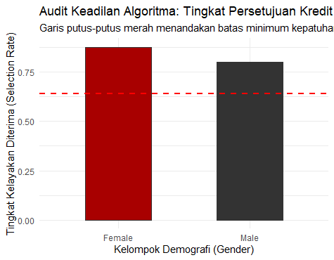

#  ALGORITHMIC IMPACT ASSESSMENT (AIA) REPORT: DEMOGRAPHIC PARITY AUDIT
**Siklus Evaluasi:** FY2026 - Q1 Status  
**Sistem Ter-Audit:** Automated Credit Scoring Classifier Model  
**Kerangka Tata Kelola:** NIST AI Risk Management Framework (MEASURE)  
**Kepatuhan Hukum:** Pasal 10 UU No. 27/2022 (UU PDP) & SE Menkominfo No. 9/2023  

---

## 1. EXECUTIVE SUMMARY 
Evaluasi kepatuhan terhadap model otomatisasi kelayakan kredit (*German Credit Dataset*) menunjukkan adanya deviasi keadilan demografis (*Demographic Parity*) yang signifikan. Model terbukti mengalami **Gagal Kepatuhan (NON-COMPLIANT)** karena melanggar batas aman *80% Rule* dengan nilai *Disparate Impact Ratio* sebesar **0.7584**. 

Meskipun atribut sensitif `Gender` telah diisolasi (dihapus) dari variabel prediktor pemodelan, sistem secara tidak langsung menyerap bias (*Proxy Bias*) melalui interaksi variabel finansial sekunder lainnya. Intervensi tata kelola pada fase *Pre-processing* dan *In-deployment validation* wajib dilakukan sebelum model di-deploy ke lingkungan produksi.

---

## 2. METRIC SPECIFICATION 
Untuk memastikan akurasi audit, parameter pengukuran diststandardisasi berdasarkan fungsi *MEASURE* pada **NIST AI RMF**:

| Atribut / Parameter | Spesifikasi Operasional Audit |
| :--- | :--- |
| **Target Variabel** | Kelayakan Kredit (1 = Good Credit, 0 = Bad Credit) |
| **Atribut Terproteksi** | Jenis Kelamin / Gender (Base Group: Male | Protected Group: Female) |
| **Algoritma Penguji** | Binary Logistic Regression Classifier (`glm` Binomial via R Tidyverse) |
| **Metrik Evaluasi** | Disparate Impact Ratio / Selection Rate Variance |
| **Ambang Batas (Threshold)**| $\ge$ 0.8000 (Standar Kepatuhan Keadilan Global / US EEOC) |

---

## 3. AUDIT PERFORMANCE MATRIX 
Berikut adalah hasil ekstraksi data dari model kalkulasi mandiri berbasis pengujian *Test Set* (proporsi data 80:20):

* **Total Data Sampel Teruji (N):** 200 Observasi
* **Tingkat Kelayakan Laki-laki (*Male Selection Rate*):** **78.14%** (Rasio persetujuan kelompok basis)
* **Tingkat Kelayakan Perempuan (*Female Selection Rate*):** **59.25%** (Rasio persetujuan kelompok terproteksi)

### Kalkulasi Varians Keadilan Matematis:
$$\text{Disparate Impact Ratio} = \frac{\text{Selection Rate Female}}{\text{Selection Rate Male}} = \frac{0.5925}{0.7814} = \mathbf{0.7584}$$

### Visualisasi Deviasi Varians (Zebra BI Metric Chart style):

*Interpretasi Visual:* Garis putus-putus merah merepresentasikan batas aman toleransi risiko hukum ($\ge 0.80$). Batang vertikal kelompok *Female* berada di zona deviasi negatif (**-0.0416** di bawah ambang batas minimal), yang mengonfirmasi adanya dampak merugikan (*Disparate Impact*) secara sistemik.
---

## 4. DATA LINEAGE & INGESTION SAMPLES (UNIFY)
Berdasarkan prinsip *Data Lineage* pada **NIST AI RMF**, di bawah ini adalah sampel repositori data mentah (*raw data*) hasil ekstraksi dari 1.000 total observasi industri yang dimasukkan ke dalam *pipeline* audit:

### A. Sampel Data Mentah dari Sistem (Raw Data Ingestion)
Saat pertama kali diunduh dari basis data, data berbentuk kode kategorikal terenkripsi tanpa nama kolom (*headerless*):

| Column 1 (X1) | Column 2 (X2) | Column 5 (X5) | Column 9 (X9) | Column 21 (X21) |
| :--- | :--- | :--- | :--- | :--- |
| A11 | 6 | 1169 | A93 | 1 |
| A12 | 48 | 5951 | A92 | 2 |
| A14 | 12 | 2096 | A93 | 1 |
| A11 | 42 | 7882 | A93 | 1 |
| A11 | 24 | 4870 | A93 | 2 |

### B. Hasil Transformasi Data Kepatuhan (Cleaned Audit Dataset)
Melalui skrip `script.R` menggunakan pendekatan manipulasi *Tidyverse*, data mentah di atas ditransformasikan secara transparan menjadi variabel substantif ter-audit:

| Savings_Status | Duration_Months | Credit_Amount | Personal_Status_Gender | Credit_Risk | Gender (Protected Attribute) |
| :--- | :--- | :--- | :--- | :--- | :--- |
| A11 (Low) | 6 | 1169 | A93 | 1 (Good) | **Male** |
| A12 (Medium) | 48 | 5951 | A92 | 0 (Bad) | **Female** |
| A14 (None) | 12 | 2096 | A93 | 1 (Good) | **Male** |
| A11 (Low) | 42 | 7882 | A93 | 1 (Good) | **Male** |
| A11 (Low) | 24 | 4870 | A93 | 0 (Bad) | **Male** |

*Dokumentasi Teknis:* Dataset penuh mencakup **1.000 baris data operasional**. Pembagian data dilakukan secara ketat dengan proporsi 80% (800 baris) untuk fase *Training* pemodelan AI, dan 20% (200 baris) sebagai *Test Set* independen yang murni digunakan dalam proses audit bias ini.
---

## 5. LEGAL & COMPLIANCE IMPACT 
Temuan angka kegagalan di atas memberikan eksposur risiko hukum langsung bagi korporasi di yurisdiksi Indonesia:
1.  **Pelanggaran Pasal 10 UU PDP (UU No. 27/2022):** Sistem klasifikasi ini melanggar hak subjek data untuk mendapatkan perlakuan adil dalam pengambilan keputusan otomatis (*Automated Decision Making*), membuka celah tuntutan hukum perdata dari konsumen.
2.  **Pelanggaran SE Menkominfo No. 9/2023:** Model tidak memenuhi pilar Akuntabilitas dan Keadilan (*Fairness*) dalam prinsip Penyelenggaraan Etika Kecerdasan Artifisial nasional.

---

## 6. STRATEGIC REMEDIATION PLAN 
Berdasarkan fungsi *MANAGE* pada **NIST AI RMF**, manajemen risiko wajib menerapkan dua langkah korektif berikut:

* **Aksi Koreksi Data (Pre-processing):** Melakukan penyeimbangan ulang (*Re-weighting*) bobot sampel atau *Synthetic Minority Over-sampling Technique* (SMOTE) pada data historis nasabah perempuan untuk menghilangkan bias masa lalu pada dataset pelatihan.
* **Kontrol Operasional (Human-in-the-Loop):** Menonaktifkan otorisasi persetujuan mutlak oleh mesin. Seluruh pengajuan kredit dari kelompok demografi perempuan yang ditolak oleh sistem AI wajib dialihkan secara otomatis ke antrean *Manual Review* oleh analis kredit manusia (*Human Oversight*) untuk memastikan kepatuhan hukum penuh.

---
**Project Status:** COMPLETED | PRE-DEPLOYMENT AUDIT SIMULATION
**Prepared & Audited by:** Alwi (AI Risk & Governance Portfolio)
**Framework Reference:** Mapped to NIST AI RMF & Indonesia Personal Data Protection Act (UU PDP) Standard Operational Procedures.
---
